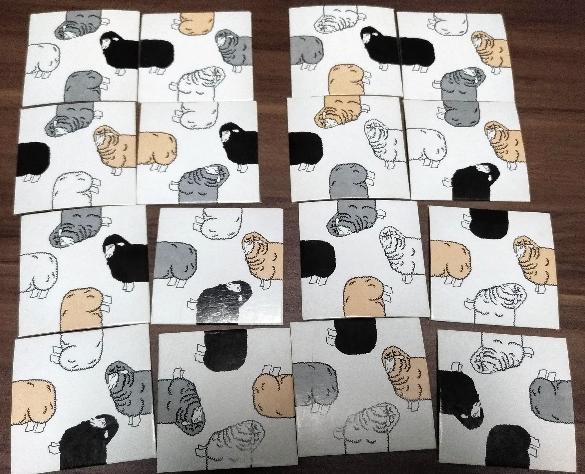
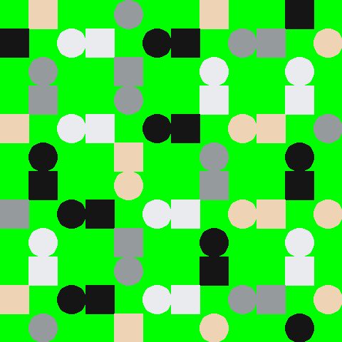
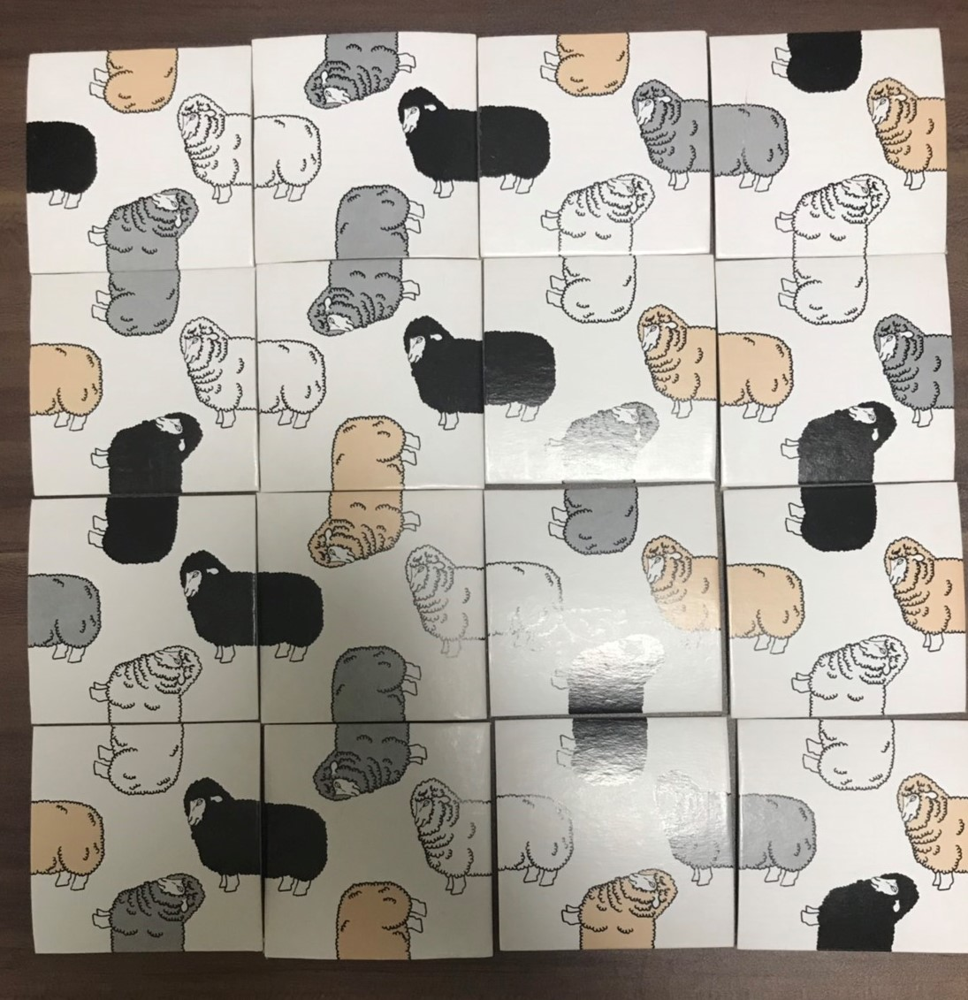

# crazy_sheep

## 概要
クレイジーシープというゲームがあります。目的は以下の16枚のカードを正しく並び替えることです。  
  

SATソルバを用いることで以下の解を得ます。  
  

実際に並び替えたものが以下です。  
  

## 参考
togatoga「togatoga/togasat: A Header-Only CDCL SAT Solver for Programming Contest」https://github.com/togatoga/togasat (2020年4月13日参照)  
まめめも「SAT ソルバで数独を解く方法」https://mametter.hatenablog.com/entry/20080108/p1 (2020年4月13日参照)
